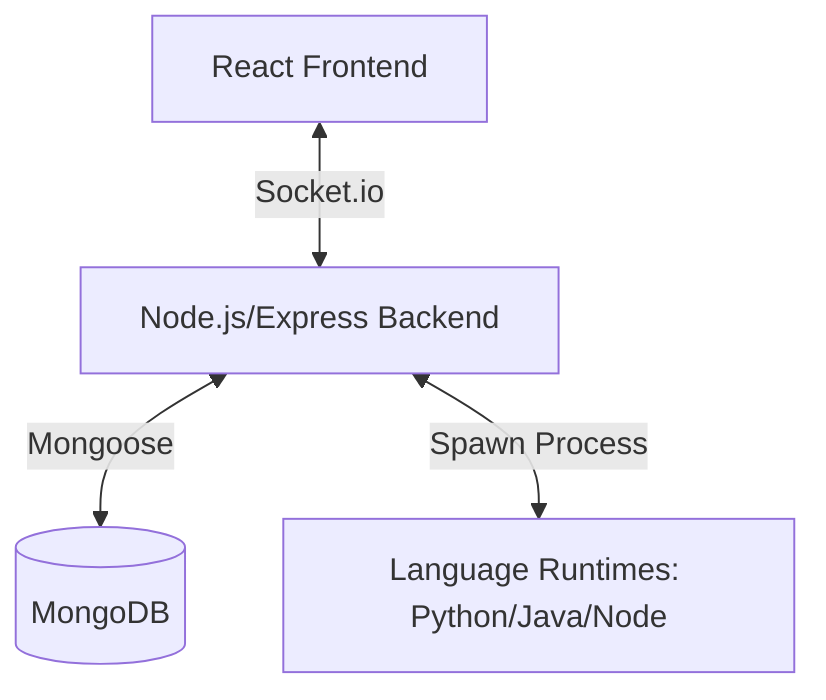

# Software Requirements Specification (SRS) - Smart Note Collab

## 1. Introduction

### 1.1 Purpose
The purpose of this document is to specify the software requirements for the **Smart Note Collab** project. This document provides a comprehensive description of the system's functional and non-functional requirements, serving as a guideline for developers and stakeholders.

### 1.2 Scope
Smart Note Collab is a real-time collaborative code editor designed to facilitate seamless teamwork among developers. It allows multiple users to join "Rooms," edit files simultaneously, track changes, execute code, and manage file versions.

### 1.3 Definitions, Acronyms, and Abbreviations
*   **MERN**: MongoDB, Express.js, React, Node.js.
*   **Socket.io**: A library for real-time web applications.
*   **IDE**: Integrated Development Environment.
*   **SRS**: Software Requirements Specification.
*   **Monaco**: The code editor engine that powers VS Code.

## 2. Overall Description

### 2.1 Product Perspective
Smart Note Collab is a standalone web application built using the MERN stack. It utilizes WebSockets (via Socket.io) for real-time data synchronization and the Monaco Editor for a premium coding experience.

### 2.2 System Architecture
The application follows a client-server architecture with real-time bidirectional communication.

### 2.3 Product Functions
*   **User Authentication**: JWT-based login and registration.
*   **Real-time Collaboration**: Simultaneous editing, cursor tracking, and line locking.
*   **Room Management**: Creation and joining of secured rooms via passwords.
*   **Integrated Terminal**: Multi-language code execution.
*   **Version Control**: Saving and restoring file versions, with detailed edit logs.
*   **Note Taking**: Integrated notes for each file within a room.

### 2.3 User Classes and Characteristics
*   **Developers**: Primary users who need a collaborative environment for coding and debugging.
*   **Educators/Students**: Users performing pair programming or remote learning.

### 2.4 Operating Environment
*   **Client**: Modern web browsers (Chrome, Firefox, Safari, Edge).
*   **Server**: Node.js environment.
*   **Database**: MongoDB (Atlas or local).

### 2.5 Design and Implementation Constraints
*   Real-time updates must be low-latency.
*   Concurrent edits must be handled gracefully to avoid race conditions.
*   The system must be responsive and visually appealing.

## 3. System Features

### 3.1 User Authentication
*   **Description**: Users must be able to create accounts and log in securely.
*   **Requirement**: Use bcrypt for password hashing and JWT for session management.

### 3.2 Room and Collaboration Management
*   **Description**: Users create rooms with unique IDs and passwords.
*   **Functional Requirements**:
    *   **Room Isolation**: Only authenticated users with the correct password can enter.
    *   **User Presence**: Track users currently in the room with unique colors for cursors.
    *   **Join/Leave Notifications**: Real-time alerts when users join or depart.

### 3.3 Real-time Collaborative Editor
*   **Description**: Multiple users can edit the same file simultaneously.
*   **Functional Requirements**:
    *   **Content Sync**: Changes broadcasted to all room members via Socket.io.
    *   **Cursor Tracking**: Real-time display of other users' cursors with usernames and random colors.
    *   **Line Locking**: Prevent multiple users from editing the same line at exactly the same time. Locks are auto-released on disconnect.
    *   **Language Support**: Automatic language detection (JavaScript, Python, HTML, CSS) based on file extension.

### 3.4 File Operations
*   **Description**: Manage files within a collaboration room.
*   **Functional Requirements**:
    *   **Create/Rename/Delete**: Users can manage multiple files within a single room.
    *   **Upload**: Import existing files into the room.
    *   **Download**: Export current file content to the local system.

### 3.5 Code Execution Environment
*   **Description**: Run code snippets (Python, Java, JavaScript) directly from the browser.
*   **Requirement**: Backend handlers execute code in a controlled environment and stream results back to the frontend terminal.

### 3.6 Version Control and History
*   **Description**: Track changes and allow recovery of previous states.
*   **Functional Requirements**:
    *   **Edit Logs**: Detailed logs of line-level changes (who, what, when).
    *   **Versions**: Explicitly saved snapshots of files with timestamps.
    *   **Restore**: Ability to roll back to a specific version, automatically informing all room members of the restoration.
    *   **Integrated Notes**: Each file supports persistent notes for additional context.

## 4. External Interface Requirements

### 4.1 User Interfaces
*   Responsive React UI.
*   Monaco Editor integration.
*   Sidebar for file management and project overview.
*   History panel for edit logs and versioning.

### 4.2 Software Interfaces
*   **Frontend**: React, Vite, Tailwind CSS.
*   **Backend**: Express.js, Socket.io.
*   **Database**: MongoDB (Mongoose).

## 5. Non-functional Requirements

### 5.1 Performance Requirements
*   Typing latency should be less than 100ms.
*   Room joins should be processed under 2 seconds.

### 5.2 Security Requirements
*   SSL/TLS for data in transit.
*   Secure password storage (Bcrypt).
*   JWT-protected API routes.

### 5.3 Software Quality Attributes
*   **Scalability**: Support multiple concurrent rooms and users.
*   **Usability**: Intuitive interface with premium aesthetics.
*   **Reliability**: Automatic debounced saving to prevent data loss.
